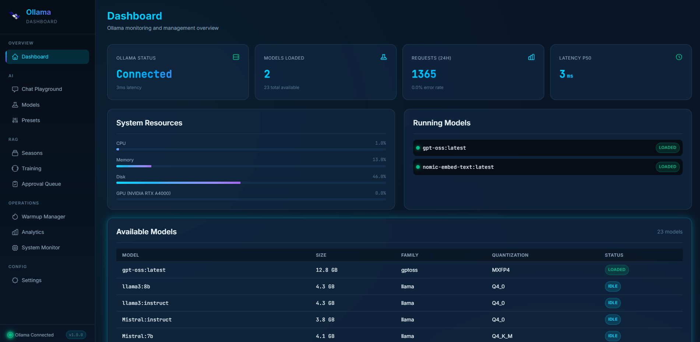
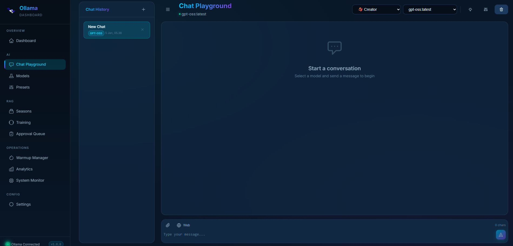
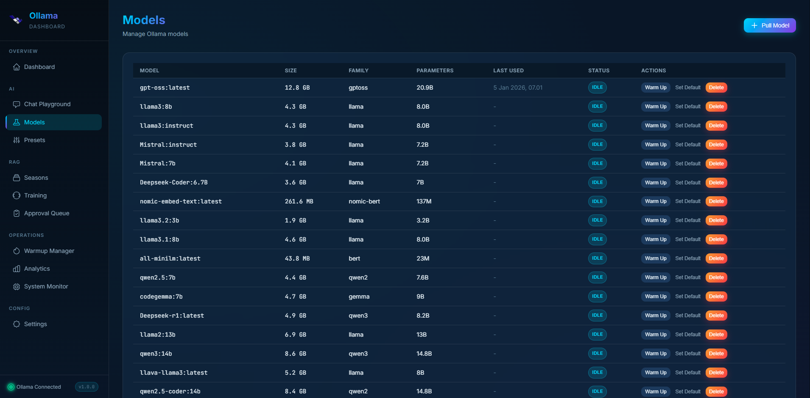
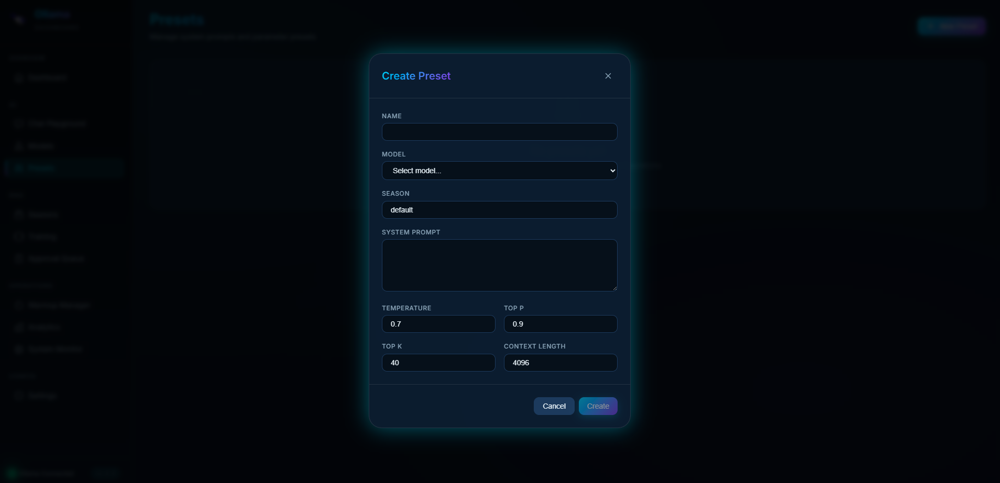
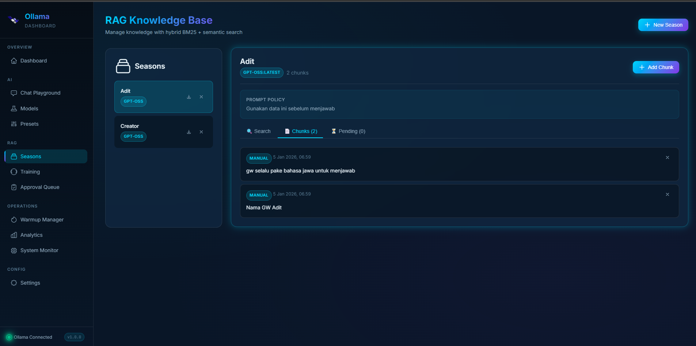
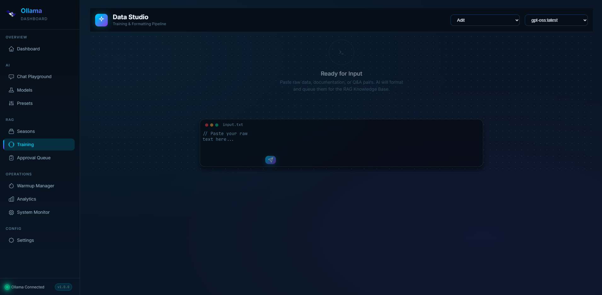
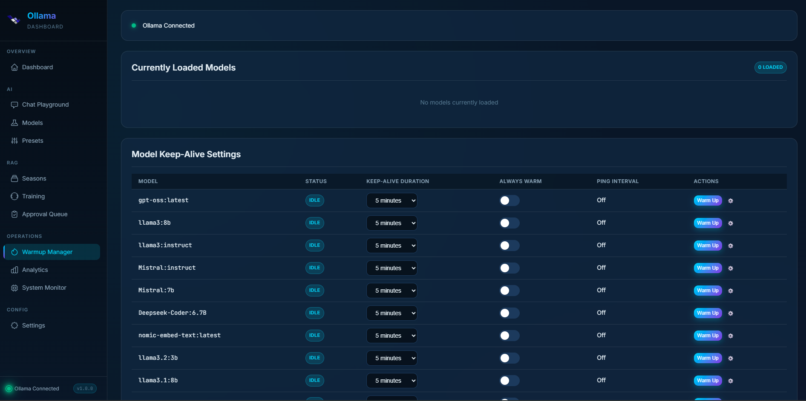
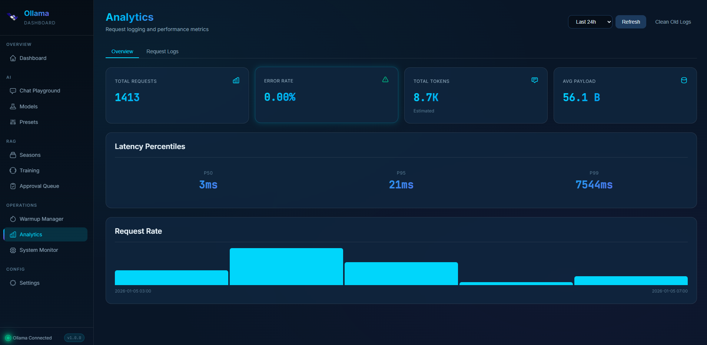
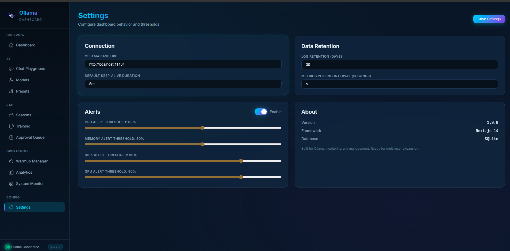

# Ollama Management

A modern, technical monitoring and management dashboard for Ollama LLM deployments.

## Features

| | | |
|:---:|:---:|:---:|
|  |  |  |
|  |  |  |
|  |  |  |


- **Chat Playground**: Streaming chat interface with adjustable parameters.
  - **Deep Web Search**: Real-time web search with "Deep Crawl" capability (extracts full content from top results). Zero configuration required.
  - **Document Upload**: Direct upload of PDF, MD, and TXT files for context-aware chatting.
  - **Hidden Context**: Search results and documents are injected invisibly into the AI context to keep the chat UI clean.
  - **Export**: Export Seasons and Presets to JSON for easy sharing.
- **RAG Training Studio**: Specialized "Data Studio" interface to train AI models using raw data. 
  - Chat-based formatting pipeline.
  - Auto-scrapes and formats responses into Markdown.
  - Automatically queues formatted content for approval.
- **Advanced RAG System**:
  - **Seasons**: Organize knowledge bases by context or time period.
  - **Approval Queue**: Review, edit, and approve incoming knowledge chunks.
  - **Bulk Actions**: "Approve All" functionality for rapid knowledge base building.
  - **Hybrid Search**: Combines BM25 keywords and Semantic search for optimal retrieval.
- **Model Management**: 
  - Pull and Delete models from Ollama Library.
  - **Warmup Manager**: Configure model keep-alive durations and pre-load strategies to reduce cold starts.
  - Automatic Model Sync: Keeps local metadata in sync with active Ollama instance.
- **Presets**: Save and share common prompt configurations and system prompts.
- **System Monitoring**: Real-time visualization of CPU, Memory, Disk, Network I/O, and GPU utilization (NVIDIA).
- **Analytics & Logs**: Detailed request logging, latency distribution tracking, and error rate monitoring.
- **Localization**: Default Timezone set to GMT+7 (WIB) for all timestamps.

## Tech Stack

- **Frontend**: Next.js 14 (App Router) + TypeScript
- **Dependencies**: `pdf-parse`, `cheerio` (for web scraping)
- **Styling**: Vanilla CSS with 60-30-10 dark blue color scheme
- **Database**: SQLite via better-sqlite3
- **State**: Zustand

## Getting Started

### Prerequisites

- Node.js 18+
- Ollama running locally or remotely
- (Optional) NVIDIA GPU with drivers for GPU monitoring

### Installation

```bash
# Install dependencies
npm install

# Copy environment file
cp .env.example .env

# Edit .env with your Ollama URL
# OLLAMA_BASE_URL=http://localhost:11434

# Run development server
npm run dev
```

Open [http://localhost:3000](http://localhost:3000).

### Production Build

```bash
npm run build
npm start
```

## Environment Variables

| Variable | Default | Description |
|----------|---------|-------------|
| `OLLAMA_BASE_URL` | `http://localhost:11434` | Ollama API endpoint |
| `DATABASE_PATH` | `./data/ollama-dashboard.db` | SQLite database path |
| `LOG_RETENTION_DAYS` | `30` | Days to keep request logs |
| `PORT` | `3000` | Server port |

## Project Structure

```
src/
├── app/                    # Next.js App Router pages
│   ├── api/               # API routes
│   └── (dashboard)/       # Dashboard pages
├── components/            # React components
├── lib/                   # Core libraries
│   ├── db/               # SQLite database
│   ├── ollama/           # Ollama client
│   └── monitoring/       # System monitoring
├── stores/               # Zustand state
└── types/                # TypeScript types
```

## API Endpoints

- `GET /api/status` - Dashboard status
- `GET/POST/PATCH/DELETE /api/models` - Model management
- `POST /api/models/pull` - Pull model with progress
- `POST /api/chat` - Streaming chat
- `GET /api/system` - System metrics
- `GET/POST /api/analytics` - Request analytics
- `GET/POST/PATCH/DELETE /api/presets` - Preset management
- `GET/POST/PATCH /api/warmup` - Warmup configuration
- `GET/POST/PATCH/DELETE /api/rag` - RAG management
- `POST /api/search` - Deep web search
- `POST /api/upload` - Document upload and parsing
- `GET /api/export` - Export Presets and Seasons

## Design

- **Color Scheme**: 60-30-10 (Dark Blue dominant)
  - Primary (60%): `#0a1628`
  - Secondary (30%): `#1e3a5f`
  - Accent (10%): `#00d4ff`
- **Typography**: Inter (UI), JetBrains Mono (code)
- **Style**: Premium "Data Studio" aesthetic, Glassmorphism, Animated transitions, Rich gradients.

## Future Roadmap

- Multi-user authentication
- Embeddings generation for RAG
- Advanced caching layer
- Webhook alerts
- API key management
